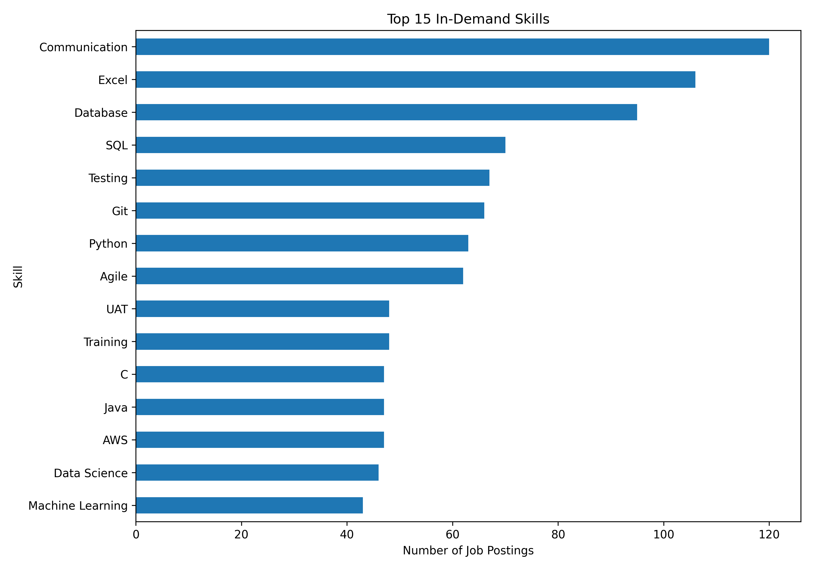
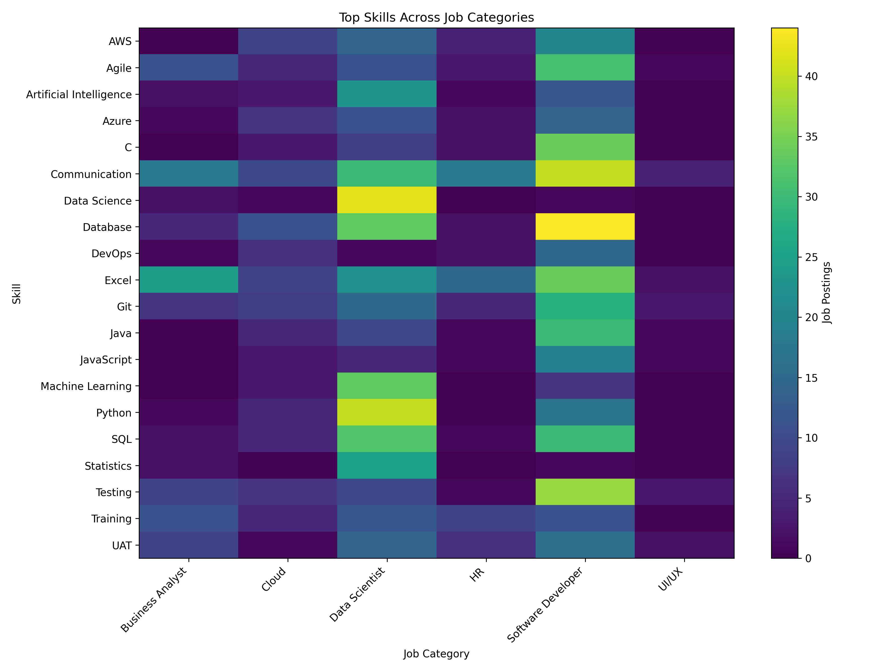
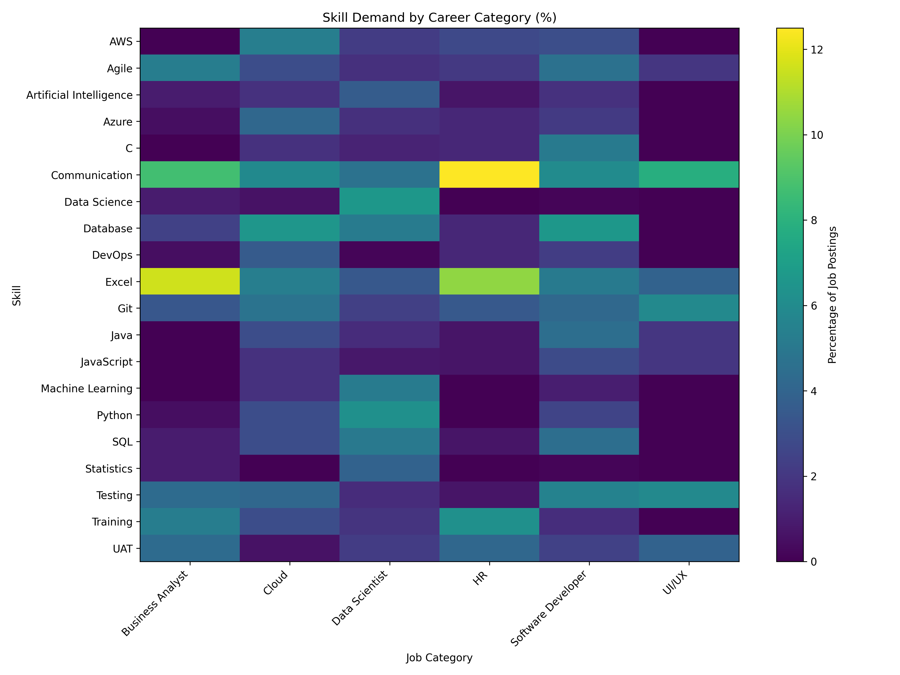

# SkillRadar — Job Market Skill Analytics

SkillRadar is an end-to-end data analytics project that analyzes job postings to identify **in-demand skills, career-specific skill requirements, and transferable skills across job categories**.

The project processes raw job-posting data using Python, performs analytical queries using PostgreSQL, and generates visualizations to turn job-market data into actionable career insights.

---

## 🎯 Project Objective

The goal of SkillRadar is to answer questions such as:

- Which skills are most frequently mentioned in job postings?
- What skills are most important for different career categories?
- Which skills are transferable across multiple careers?
- How does skill demand differ between careers such as Data Science, Software Development, Cloud, Business Analysis, HR, and UI/UX?
- What skills should candidates prioritize for a target career?

---

## 📊 Dataset

The dataset contains **323 raw job-posting records** which were cleaned and processed into **211 usable job postings** across six career categories:

| Career Category | Job Postings |
|---|---:|
| Software Developer | 82 |
| Data Scientist | 54 |
| Business Analyst | 28 |
| HR | 22 |
| Cloud | 20 |
| UI/UX | 5 |
| **Total** | **211** |

The project extracts skills from job descriptions and creates job-skill relationships for further analysis.

---

## 🔄 Data Analytics Pipeline

```text
Raw Job Postings
       ↓
Data Cleaning
       ↓
Skill Extraction
       ↓
Skill Normalization
       ↓
Job-Skill Dataset
       ↓
PostgreSQL Analysis
       ↓
Career Skill Profiles
       ↓
Visualizations

## 📊 Results

### Top In-Demand Skills

Communication, Excel, Database, SQL, Testing, Git, and Python are among the most frequently identified skills in the dataset.

### Career-Specific Findings

- **Business Analyst:** Excel, Business Analyst, Communication, Agile
- **Cloud:** Database, Communication, AWS, Excel, Git
- **Data Scientist:** Data Science, Python, Database, Machine Learning, SQL
- **HR:** Communication, Excel, HR, Training
- **Software Developer:** Database, Communication, Testing, C, Excel, Agile
- **UI/UX:** UI/UX, UX Design, Communication, User Experience, CSS/Figma

## 📊 Visualizations

### Top 15 In-Demand Skills



### Skills Across Career Categories



### Skill Demand by Category (%)


       ↓
Career Insights
